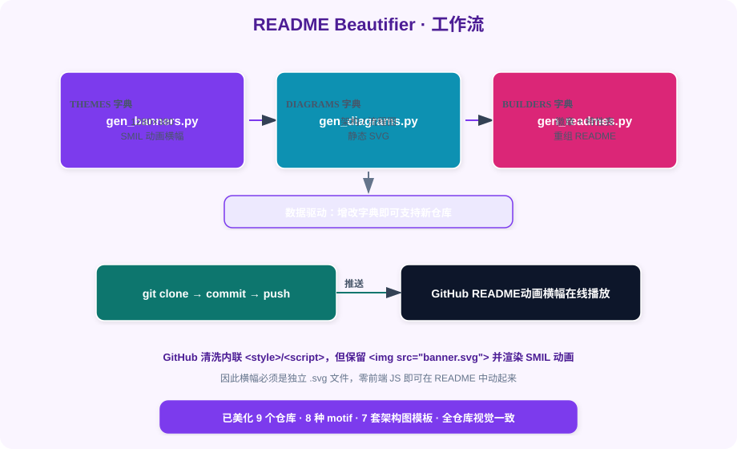

  

**✨ 把任意 GitHub 仓库的 README 变成带动画横幅、架构图、徽章与特性表的精美 Landing Page**

数据驱动 · 保留原文 · 自动推送 · 视觉一致

---

## ✨ 核心特性

| 特性 | 说明 |
|------|------|
| 🎬 **SMIL 动画横幅** | 每个仓库生成 1280×380 的独立 SVG hero banner，GitHub 原生播放动画，零前端 JS |
| 🏗️ **架构 / 流程图** | 为技术仓库自动产出三层架构或工作流 SVG，注入到目录结构之前 |
| 🏷️ **徽章 + 特性表** | 自动拼接 shields.io 状态徽章与核心特性对照表，视觉一致 |
| 🧬 **数据驱动** | THEMES / DIAGRAMS / BUILDERS 三个字典驱动，新增仓库只改字典不改逻辑 |
| 🚀 **一键推送** | 克隆 → 提交 → 推送，并校验远程 SVG 仍保留 SMIL 动画 |

---

## 🔧 工作流

  

---

**Made with ❤️ by Hyhyhyyy**

